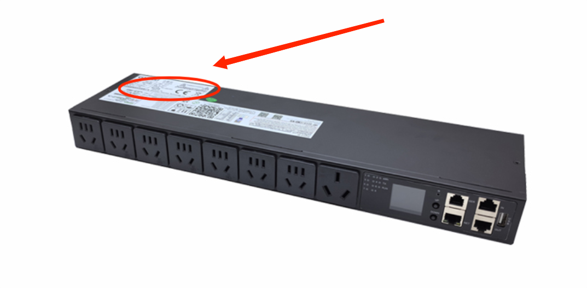

# AutoCharge
一个实现自动化DC测试的电源控制工具，需配合专门的PDU使用

## 背景

为良好反映Windows PC在DC下的性能表现，需对Windows PC进行持续的DC下性能测试。但受限于电池容量，高耗能的性能测试并不能坚持很长时间。
AutoCharge在运行时可以检测Windows PC的电量，并控制PDU的开合状态，从而实现在电量低时开始充电，充满后自动断电。

## 功能

1. 直接控制PDU插口的电源开合
2. 通过判断Windows PC的电量，控制PDU插口的电源开合（Benchmark模式）

## 前置条件

1. 此程序根据[特普瑞斯官网](http://sztprs.com/case/615.html)提供的SDK进行开发。使用的PDU应支持SNMP控制功能。
2. 按照PDU贴纸上提供的信息，进入PDU管理页面，修改PDU的IP地址为“192.168.1.111”

## 使用方法

## 最新版本

[Github页面](https://github.com/ltycn/AutoCharge)

