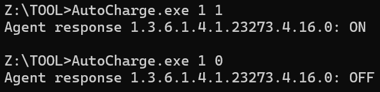
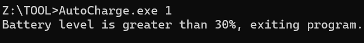

# AutoCharge
一个实现自动化DC测试的电源控制工具，需配合专门的PDU使用

## 背景

为良好反映Windows PC在DC下的性能表现，需对Windows PC进行持续的DC下性能测试。但受限于电池容量，高耗能的性能测试并不能坚持很长时间。
AutoCharge在运行时可以检测Windows PC的电量，并控制PDU的开合状态，从而实现在电量低时开始充电，充满后自动断电。

## 功能

1. 直接控制PDU插口的电源开合
2. 通过判断Windows PC的电量，控制PDU插口的电源开合（Benchmark模式）

## 前置条件

1. 此程序根据[特普瑞斯官网](http://sztprs.com/case/615.html)提供的SDK进行开发。使用的PDU应支持SNMP控制功能。
2. 为PDU接入局域网网线
2. 按照PDU贴纸上提供的信息，进入PDU管理页面，修改PDU的IP地址为“192.168.1.111”

## 使用方法

### Direct Control模式
```
AutoCharge.exe [Socket Port] [Control]
```
- Socket Port: 插口顺序（1~8）
- Control：控制开关（1：开 0：关）



### Benchmark模式
```
AutoCharge.exe [Socket Port]
```
- Socket Port: 插口顺序（1~8）
- 程序会判断当前电量，如果小于等于35%，则会打开电源持续充电至85%。期间程序会阻塞进程，充电完成后程序会自动关闭
- 如果当前电量大于35%，则程序会关闭，继续执行脚本的其他任务



## 脚本示例

```
@echo off

set "socketport="
set "pause_time=180"
set "looptimes=5"

for %%a in (0 1) do (
    "AutoCharge.exe" %socketport% %%a

    for /L %%i IN (1, 1, %looptimes%) do (
        REM Check Battery Status...
        "AutoCharge.exe" %socketport%

        REM Logging...
        start /min "" "PTAT.exe" "-m=PTAT-testname.csv" "-noappend" "-l=c"
        start /min "" "ML_Scenario.exe" -delay 1 -logname ML-testname.csv -count 100000 -logonly
        
        REM Start TESTING...
        "PCMark10Cmd.exe" "--definition=pcm10_benchmark.pcmdef" "--out=testname.pcmark10-result" "--export-xml=testname.xml"
        
        REM Kill Logging process...
        taskkill /F /IM "PTAT.exe" /IM "ML_Scenario.exe"
        timeout /t %pause_time% > nul
    )
)
```
## 项目地址

[OneDrive下载地址](https://lenovobeijing-my.sharepoint.com/:f:/g/personal/liuty24_lenovo_com/EniBIocqO5NPvEqtQ1vVU4EBavNws7CQPtVtheaVGgBXVw?e=KaYuxu)

[Github页面](https://github.com/ltycn/AutoCharge)

